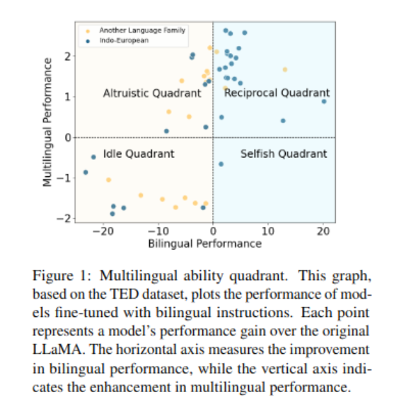

---
# Paper-1
## How Multilingual is Multilingual LLM
**Publication Link**: [https://arxiv.org/pdf/2311.09071.pdf](https://arxiv.org/pdf/2311.09071.pdf)
**publication Date**: November 2023
### Abstract:
Large Language Models (LLMs), trained predominantly on extensive English data, often exhibit limitations when applied to other languages. Current research is primarily focused on enhancing the multilingual capabilities of these models by employing various tuning strategies. Despite their effectiveness in certain languages, the understanding of the multilingual abilities of LLMs remains incomplete. This study endeavors to evaluate the multilingual capacity of LLMs by conducting an exhaustive analysis across 101 languages, and classifies languages with similar characteristics into four distinct quadrants. By delving into each quadrant, we shed light on the rationale behind their categorization and offer actionable guidelines for tuning these languages. Extensive experiments reveal that existing LLMs possess multilingual capabilities that surpass our expectations, and we can significantly improve the multilingual performance of LLMs by focusing on these distinct attributes present in each quadrant

---

### Publication Summary
In this paper the authors explore how well LLMs can handle different languages. In the study 101 languages are analyzed and are categorized into four groups. The experiment have shown that LLMs have better multilingual capabilities than expected and focusing on special attributes can enhance performance.

---

**Highlights from the paper**:

1.  **Limitations when applied to non-English languages**
	- Models like GPT, PaLM, LLaMA are predominantly trained on English data
	- This limits their applicability to other languages
---

2.  **Incompetency of current studies** 
	- Multilingual ability is understood as how effectively model that have been fine-tuned in one source language can be applied to other language.
	- The ability has been highly studied by the researchers in machine translation and multilingual pre-trained model. However there is limiting investigation for English-centric LLMs like LLaMA.
--- 

3. **The Experiment Overview**
	- The authors evaluate the multilingual capacity of LLMs across 101 languages and classifies them into four distinct quadrants, shedding light on their categorization and offering guidelines for tuning these languages.
	- _**They do not explicitly mention which of the quadrants consists certain languages, but what they have mentioned is languages from Indo-European Language family and Other Language family groups.**_
	

- The authors have provided with the list of language family list with their corresponding languages, yet it is unclear which specific languages they have used during training and evaluation for classifying them for each quadrant.
- The listed language families for the experiment contains:  
    
    *Indo-European, Japonica, Koreanic, Afro-Asiatic, Dravidian, Turkic, Niger-Congo_*
---
4. **Inherent Multilingual Capabilities** 
   The researchers have observed the following by exploring the inherent multilingual capabilities  
    - Fine-tuning LLMs with bilingual data improves translation performance not only for the specific language pair but also for other language pairs.
    - Bilingual-tuned models show remarkable consistency in multilingual performance across multiple languages.
    - Some bilingual models exhibit surprising behaviors, where fine-tuning hurts their own performance but significantly improves their multilingual performance.
    - _**Languages can be categorized into four quadrants based on their bilingual and multilingual performance: reciprocal, altruistic, idle, and selfish**_.
        - **Reciprocal**_**:**_
            - Models trained on languages from the reciprocal quadrant demonstrate strong bilingual and multilingual performance.
        - **Altruistic:**
            - Models trained on languages from the altruistic quadrant prioritize enhancing others with minimal impact on their own performance.
        - **Idle:**
            - Languages in the idle quadrant show minimal impact from existing tuning strategies.
        - **Selfish:**
            - Training in a specific language in the selfish quadrant typically improves the performance of that language and has minimal impact on other languages.
---
5. **Improving Capabilities** 
   Language Specific Guidelines.
	- **Reciprocal Quadrant**:
	    - The reciprocal quadrant consists of linguistically similar languages, mainly Indo-European languages, which can enhance each other's performance through training. 
	    - Embed FT strategy is recommended for reciprocal languages as it achieves the best performance-generalization trade-off.
	    - Full FT and Embed FT strategies are compared for bilingual and multilingual performance, with Embed FT excelling in adapting to various languages.
	    - The Full FT model's multilingual capabilities are influenced by language quantity, while the Embed FT model remains unaffected.
	
	- **Altruistic**: 
	    - Altruistic languages show selfless characteristics, where training with their data may decrease their own performance but improve performance in other languages.
	    - The primary error for fine-tuned models is "oscillatory hallucination" which leads to lower performance compared to the original model.
	    - Altruistic languages have a significant overlap in tokenized results with English, leading to enhanced performance in Indo-European languages.
	    - Full FT with a minimal dataset effectively enhances bilingual performance and maintains a robust multilingual effect for altruistic languages.
	- **Idle**:
	    - Idle languages exhibit inertia and training with their data neither enhances their own performance nor influences other languages.
	    - Idle languages are characterized by over-tokenization, resulting in longer sequences and lower performance.
	    - Shortening subword sequences can significantly boost the performance of idle languages by addressing the over-tokenization problem.
	- **Selfish**: Default expected improvement

## **Conclusion:**
- The suggested strategy for reciprocal languages is Embed FT.
- For altruistic languages, full FT with a minimal dataset is recommended for bilingual performance, while Embed FT is recommended for multilingual performance.
- Shortening sub-word sequences can enhance the performance of idle languages.