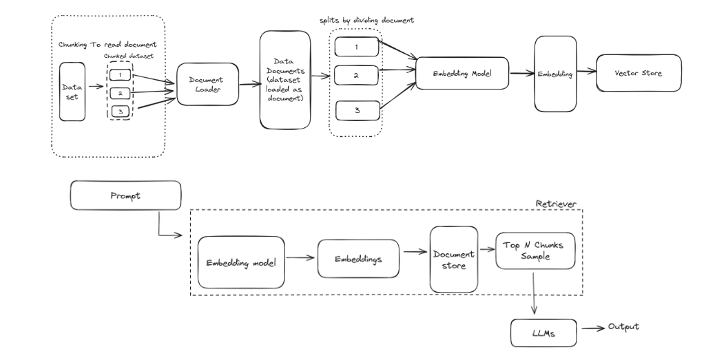
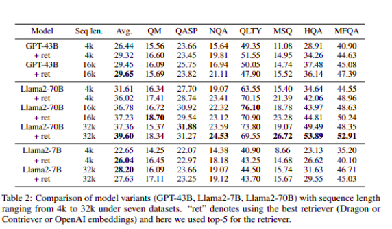

---
# Paper-3
## RETRIEVAL MEETS LONG CONTEXT LARGE LANGUAGE MODELS
**Publication Link**: [Link](https://arxiv.org/pdf/2310.03025.pdf) 
**Publication Date**: January, 2024

### Abstract:
Extending the context window of large language models (LLMs) is getting popular recently, while the solution of augmenting LLMs with retrieval has existed for years. The natural questions are: i) Retrieval-augmentation versus long context window, which one is better for downstream tasks? ii) Can both methods be combined to get the best of both worlds? In this work, we answer these questions by studying both solutions using two state-of-the-art pretrained LLMs, i.e., a proprietary 43B GPT and Llama2-70B. Perhaps surprisingly, we find that LLM with 4K context window using simple retrieval-augmentation at generation can achieve comparable performance to finetuned LLM with 16K context window via positional interpolation on long context tasks, while taking much less computation. More importantly, we demonstrate that retrieval can significantly improve the performance of LLMs regardless of their extended context window sizes. Our best model, retrieval-augmented Llama2-70B with 32K context window, outperforms GPT-3.5- turbo-16k and Davinci003 in terms of average score on nine long context tasks including question answering, query-based summarization, and in-context few-shot learning tasks. It also outperforms its non-retrieval Llama2-70B-32k baseline by a margin, while being much faster at generation. Our study provides general insights on the choice of retrieval-augmentation versus long context extension of LLM for practitioners.

---

### Summary:
**Abstract**

- The study compares the effectiveness of retrieval-augmentation and long context window approaches in improving the performance of large language models (LLMs) for downstream tasks.
- The researchers find that LLMs with a 4K context window using retrieval-augmentation can achieve comparable performance to finetuned LLMs with a 16K context window, while requiring less computation.
- The study demonstrates that retrieval can significantly enhance the performance of LLMs regardless of their extended context window sizes.
- The best model, retrieval-augmented Llama2-70B with a 32K context window, outperforms other models in terms of average score on nine long context tasks, including question answering, query-based summarization, and in-context few-shot learning tasks.
- The study provides insights for practitioners on choosing between retrieval-augmentation and long context extension of LLMs.

**Introduction**:

- The approximate attention methods have been studied for years(due to the quadratic time and memory complexities of self-attention mechanism in sequence length), the recent advance for long context LLMs with exact attention is mainly driven by the development of faster GPU with more memory and memory-efficient exact attention.
- An alternative and long-standing solution for handling long context is retrieval. Specifically, the LLMs only read relevant context retrieved from a standalone retriever, which is easier to scale and run orders of magnitudes faster than LLMs for selecting relevant context.
- The authors demonstrate that retrieval-augmentation, a method where relevant context is selected by a standalone retriever, significantly improves the performance of 4K context LLMs and can even enhance the performance of larger models like the Llama2-70B.
- The study concludes that their best model, a retrieval-augmented Llama2-70B-32k, outperforms other models in terms of average score and generation speed, indicating the potential benefits of combining retrieval methods with long context LLMs.

---

### Experiment setup summary

- The experimental setup in this study focuses on comparing the zero-shot capability of integrating long context information for generative question answering or summarization tasks using large language models (LLMs), specifically two pretrained GPT models, GPT-43B and Llama2-70B.
- The study uses seven datasets ranging from single document question answering to query-based summarization for zero-shot evaluations.(*QMSum, Qasper, NarrativeQA, QuALITY, HotpotQA, MuSiQue, and MultiFieldQA-en*)
- The study also incorporates techniques like context window extension, retrieval using Dragon, Contriever, or OpenAI embedding, and instruction tuning, where the LLMs are trained to follow instructions using a blend of datasets and a specific dialogue format.

#### Retrieval

- To use these retrievers, we first chunk each context document with 300 words, and then we encode both the questions and all chunks independently with corresponding encoders.
- The most relevant N chunks, ranked by the dot product of the question embedding and chunk embedding, are then concatenated together (following the left to right order from the most relevant to least relevant) as the context of the prompt for generation.

For the experiment, three retriever were used  
 1) **Dragon**:
	- The authors used Dragon as it achieves state-of-the-art results on both supervised and zero-shot information retrieval benchmarks

2) **Contriver model**

3) **OpenAI embedding**: For OpenAI embedding the authors have used latest “**text-embedding-ada-002**” as recommended by OpenAI. 
	- It accepts 8,191 maximum input tokens for one sequence with an output vector of 1,536 dimensions.
	- The cosine similarities are then computed between the questions and the list of contexts for retrieval ranking.

The table below shows the statics of top N retrieved chunks:

---

### Result
The result answered this both question

- The paper discusses the performance of different models, specifically GPT-43B and Llama2-70B, in tasks that require understanding of long context.
- The authors found that models without retrieval performed poorly, especially at a 4k sequence length, because valuable text gets truncated due to the context window of the foundation models.
- However, when retrieval was incorporated, there was a significant improvement in performance, with Llama2-70B showing a larger benefit from incorporating context through retrieval compared to GPT-43B

### Conclusion

The answered two question through this paper;  
1. Retrieval-augmentation versus long context window, which one is better for downstream tasks?
2. Can both methods be combined to get the best of both worlds?
